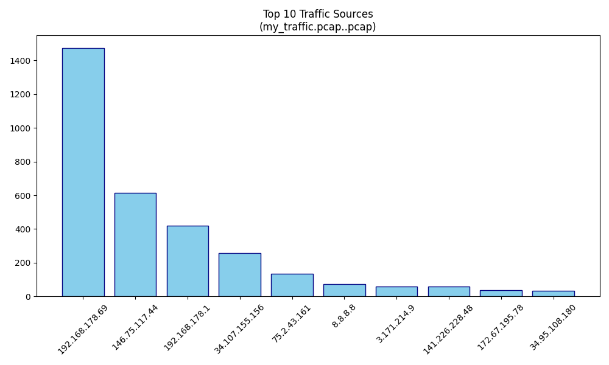
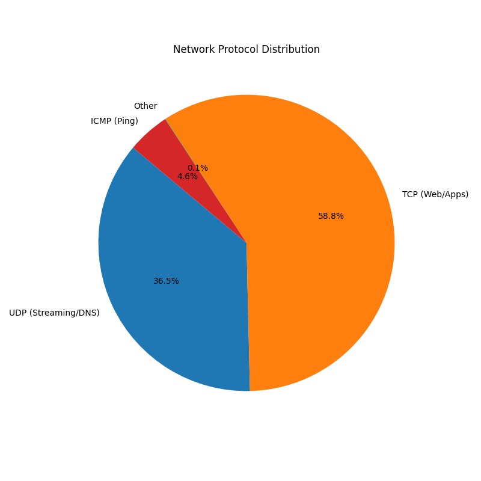
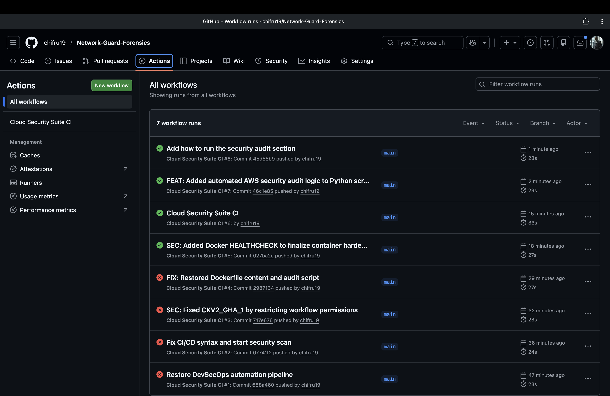

# Network Guard: Forensic & Security Audit Tool

A Python-based network analysis tool that processes PCAP files to visualize traffic patterns, calculate network latency, and audit for unencrypted credential leaks.

## 📊 Project Statistics
* **Total Packets Analyzed:** 15,467
* **Average Latency:** 32.95 ms
* **Security Alerts:** 3 potential cleartext leaks identified.

## 🛠️ Features
* **Automated Forensic Analysis:** Uses the Scapy library to parse raw packet data.
* **Credential Sniffer:** Scans unencrypted payloads for keywords like `pwd`, `auth`, and `user`.
* **Traffic Visualization:** Generates distribution reports for IP sources and protocols.

## 📈 Visual Reports
### Top Traffic Sources

### Protocol Breakdown

## 🚀 Technical Achievements
* Automated the ingestion of large-scale capture files.
* Implemented signature-based detection for PII (Personally Identifiable Information).
* Optimized data processing for 15k+ packets into actionable visual insights.
## 🚀 How to Run the Security Audit
This tool is designed to be run as a secure, isolated container.

1. **Build the hardened image:**
   `docker build -t cloud-audit-tool .`

2. **Run the automated scan:**
   `docker run --rm cloud-audit-tool`
# Pull the image file you just uploaded to your local machine
git pull origin main

# Add the image link to your README.md
echo -e "\n### 📈 Pipeline Proof of Work\n" >> README.md

